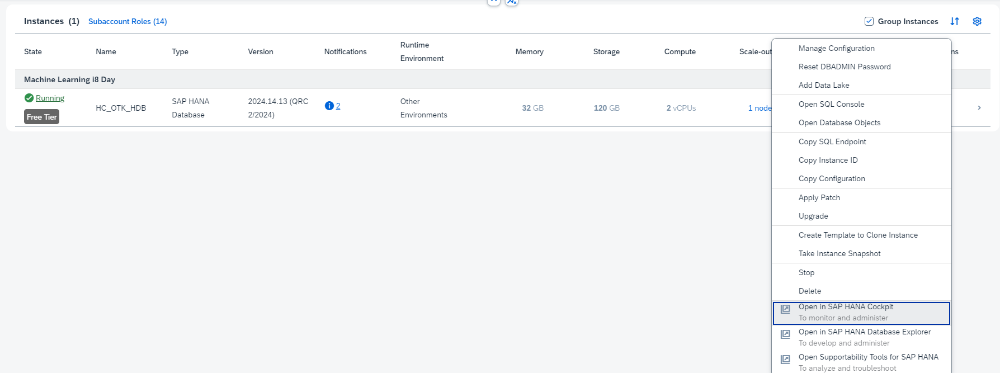
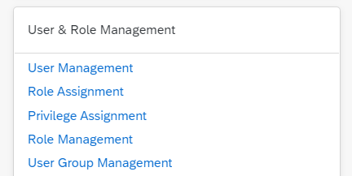
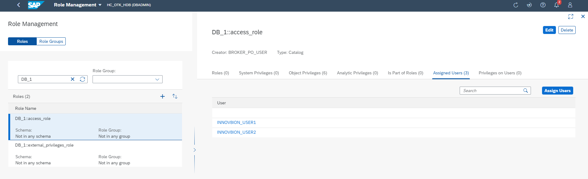

# 1) Setting up your SAP HANA Database

In this first chapter of the SAP Machine Learning course, we are going to configure our own SAP HANA Cloud instance and load the data necessary for the machine learning exercises.

## [1/9] Use SAP Business Technology Platform (BTP)
It is assumed that you have access to the SAP Business Technology Platform - either via your organization or via a free trial, as described in [prerequisites](../../prerequisites.md).

If you are using SAP BTP Trial, then open it: https://hanatrial.ondemand.com/

## [2/9] Subscribe to SAP HANA Cloud
Make sure to subscribe to the **Free Tier** of SAP HANA Cloud in BTP. The SAP HANA Predictive Analysis Library (PAL) is required in order to do the machine learning exercises. At the time of writing, PAL only seems to be available in the Free Tier.

## [3/9] Provision an instance of SAP HANA Cloud

1. In SAP BTP cockpit, open SAP HANA Cloud Central by clicking on the subscription to SAP HANA Cloud in the **Subscriptions** tab.

2. Click on **Create Instance** and select the following type: **SAP HANA Cloud, SAP HANA Database**

3. Make sure to choose the **Free Tier** license. Enter a name for your instance and insert a password in the **Administrator Password** field. Size allocation is predefined for non-production instances.

4. At the **Advanced Settings**, make sure that the Predictive Analysis Library (PAL) is enabled for your instance. Allow connections from **all** IP addresses. Finally, configure the **Instance Mapping** to map the instance to the default Cloud Foundry runtime of your trial account:
    - Click on **Add Mapping**
    - **Environment Instance ID:** Supply the Organizational ID from your Cloud Foundry Environment (which can be found in the Subaccount Overview in BTP) 
    
    - **Environment Group:** Supply the Space ID from your Cloud Foundry Environment (which can be found in the URL of the BTP Cockpit after navigating to the Space details) 
    

5. After completing the previous step, you should now have a SAP HANA Cloud instance created. Make sure that it's running before continuing.

## [4/9] Open SAP Business Application Studio (BAS) and create a new dev space

1. If you are using the [SAP BTP free trial](https://account.hanatrial.ondemand.com/trial/#/home/trial), then open [SAP Business Application Studio trial](https://triallink.us10.trial.applicationstudio.cloud.sap/) from the "Quick Tool Access" section.

2. Create a new dev space and choose to create a **SAP HANA Native Application**. The dev space will automatically be configured with the most common tools you need.

3. Once the dev space has been created and it is running, open it.

## [5/9] Configuration of the dev space

1. Within BAS, click on the Cloud Foundry targets icon in the left side of the screen.

2. In this window, expand either Service or Applications and then click on the Logon icon. The first input field will prompt you for the API endpoint. Confirm that the default value is correct (this can be found in the SAP BTP Cockpit at the subaccount level). Enter the credentials of your SAP BTP account.

3. If you successfully sign in, the next input will ask you for your Organization and Space. In most situations, you will have a single choice here.

4. Upon completion of all the inputs, you should see that the Organization and Space have been set and you will see any service instances or application instances from the target space.

## [6/9] Clone repository

1. Return to the Explorer view and choose **Clone from Git**. Enter the following URL: *https://github.com/SAP-samples/hana-cf-get-started-trial*

2. If asked for the project location, choose the **/home/user/projects/** folder and press OK

3. Upon completion, press the **Open** button in the dialog in the bottom right

## [7/9] Create database artifacts

1. Expand the **SAP HANA PROJECTS** window and press the **Bind** button (plug icon)

2. Choose **Bind to an HDI container** in the first dialog and then choose **Create a new service instance**

*You might get an error here. Make sure that you have a *hdi-shared* service plan for SAP HANA Schemas & HDI Containers.*

3. Accept the default service instance name and wait for the creation to be completed. Occasionally the binding will fail on the first try with a timing issue. If you receive this error, just repeat the process of binding (but this time you will see the HDI container in the list already).

4. We are going to create three databases tables. Upload the following three files (located in this repository under */resources/database_setup/*) to the */db/src/*  folder of your HANA project. You can delete the existing *'community.hdbtable'* file if you want.
    - *TITANIC.hdbtable* (training set)
    - *TITANIC_TEST.hdbtable* (test set)
    - *TITANIC_TRUTH.hdbtable* (ground truth for test set)

5. When you have finished the previous steps, return to the **SAP HANA PROJECTS** view. Press the **Deploy** button. Wait until the build has finished successfully.

6. Press the **Open HDI container** button (next to Deploy) to start the Database Explorer. You should be able to see your container with a schema and the three tables.

## [8/9] Load data into the table

1. Open an SQL console in the Database Explorer.

2. Copy the contents of the three *.sql* files (located in this repository under */resources/database_setup/*) in the SQL console and run the statements. This will fill the the three databases with data. Confirm whether the data has been inserted correctly.

## [9/9] User configuration

1. We need to configure a user that is allowed to access the database and use the Predictive Analysis Library (PAL). Go back to SAP HANA Cloud Central. Select your HANA instance and choose the *Open in SAP HANA Cockpit* action.

2. In the cockpit, on the top right, click on the user icon and choose **Manage Cards**. Enable the **User & Role Management** card.

3. Once the card has been enabled, click on **User Management**.

4. Create a new User here. You can use the default values. For authentication, select **Password**, choose a password of your liking and make sure that **Force Password Change on Next Logon** is set to **No**.

5. Head back to the SAP HANA Cockpit and go to **Role Management**. There are two roles that need to be assigned to our User. Select the role, go to **Assigned Users** and Assign our User to the role.
    - *DB_1::access_role* : in order to access our database schema
    - *AFL__SYS_AFL_AFLPAL_EXECUTE_WITH_GRANT_OPTION* : for using PAL

6. After creating the user and assigning the roles, you should be good to go.
    - The user you created must be supplied in the *user.ini* file of the Machine Learning project.
    - Also make sure to copy the host address of your database from the SAP HANA Cockpit, as that also needs to be added to the *user.ini* file.

## Now it's time for some epic Machine Learning! 🤖
