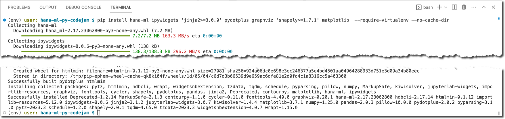
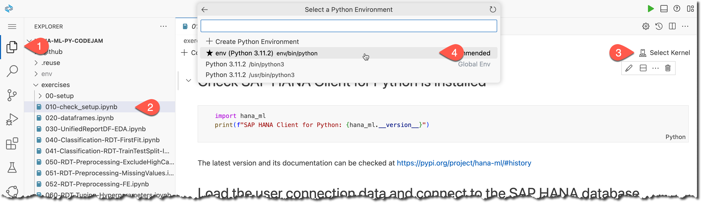
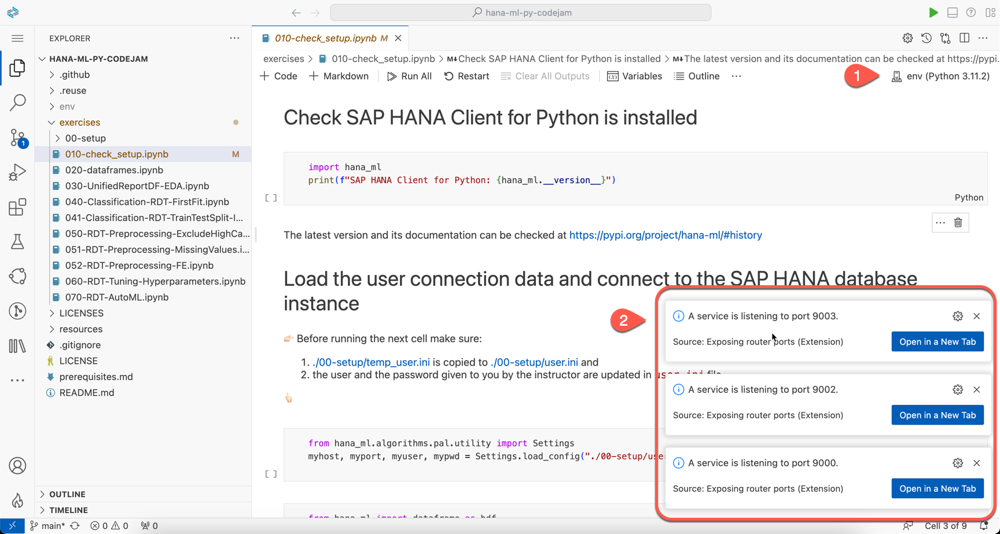

# Setup SAP Business Application Studio and a dev space

## Use SAP Business Technology Platform
It is assumed that you have access to SAP Business Technology Platform - either via your organization or via a free trial, as described in [prerequisites](../../prerequisites.md).

## Set up SAP Business Application Studio
If you are using the [SAP BTP free trial](https://developers.sap.com/tutorials/hcp-create-trial-account.html), then perform all the steps in [this tutorial - Set Up SAP Business Application Studio for Development](https://developers.sap.com/tutorials/appstudio-onboarding.html)

## Create a new Dev Space for CodeJam exercises

For this SAP CodeJam exercise create a new Dev Space called `CodeJamHANAML` of a kind **Basic** with an additional extension **Python Tools** in SAP Business Application Studio.


You should see the dev space **starting**.


Wait for the dev space to get into the **running** state and then open that dev space.

## Clone the exercises from Git repository

Once your dev space is open in BAS, use one of the available options to clone a Git repository with exercises from URL 👉🏻 `https://github.com/SAP-samples/hana-ml-py-codejam.git` 👈🏻 into your project's directory in BAS Dev Space.


Click **Open** to open a project in the Explorer view.


## Check that required extensions are installed

> SAP provides you with a mechanism to access third-party sites to view and download open-source, 3rd party or its own tools, libraries, or software components ("Extensions") to dev spaces in SAP Business Application Studio. Using this mechanism, you can view and install VS Code Extensions from the [VSX Open Registry](https://open-vsx.org/) at your own risk.

Go to Extensions using the activity bar (the left-most bar in the IDE) and type `@builtin Py` in the search bar. 


## Create a virtual environment with `venv` from a command line

The built-in [venv module](https://docs.python.org/3.9/library/venv.html#module-venv) in Python provides support for creating lightweight “virtual environments” with their own site directories, optionally isolated from system site directories.

Open a built-in terminal in BAS, eg. using the menu option.


Make sure you are in `/home/user/projects/hana-ml-py-codejam` directory, eg. using `pwd` command.

Use `venv` to create a virtual environment for your project in the new directory `~/projects/hana-ml-py-codejam/env` by using the following command:

```shell
python3 -m venv ~/projects/hana-ml-py-codejam/env --upgrade-deps
```


## Install required Python packages in the virtual environment

Activate the virtual environment using the following command:

```shell
source ~/projects/hana-ml-py-codejam/env/bin/activate
```

You should see you are in a virtual environment as indicated by `(env)` prefix in shell's prompt.


Install:

1. the `ipykernel` package to be able to run Python code in a Jupyter extension using the following command:

```shell
python -m pip install --require-virtualenv --no-cache-dir ipykernel
```


2. the [Python machine learning client for SAP HANA](https://pypi.org/project/hana-ml/) (`hana-ml`) and other required dependencies listed in https://help.sap.com/doc/cd94b08fe2e041c2ba778374572ddba9/2023_2_QRC/en-US/Installation.html#installation-guide using the following command:

```shell
python -m pip install hana-ml ipywidgets 'jinja2>=3.0.0' pydotplus graphviz 'shapely>=1.7.1' matplotlib  --require-virtualenv --no-cache-dir
```



## (Optional) Install optional Python packages in the virtual environment

Install Jupyter's `nbconvert` to be able to clean the output of notebooks, eg. before pushing to the Git repository, using the following command:
```sh
python -m pip install --require-virtualenv --no-cache-dir nbconvert
```

## Open the "Check Setup" notebook from exercises

In your BAS close the terminal. 

Go to Explorer and open a `exercises/0x10-setup-check/0x10-check_setup.ipynb` notebook. 

It should open in a Jupyter extension.

Next, select a kernel `env` (the virtual environment you set up earlier) from **Python Environments**.



The kernel should be set in a few seconds you should get messages about Jupyter server processes started in the background ready to execute code from your notebook.



## 🤓 Now you are ready to use SAP Business Application Studio to go one-by-one through exercises! 

### Engage, learn and enjoy!