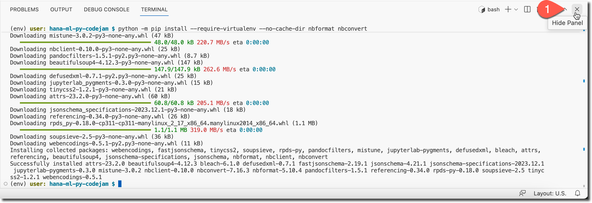
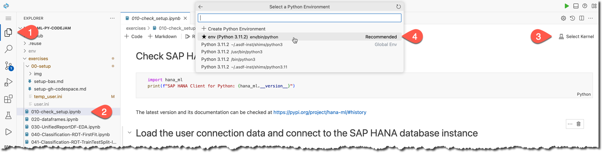

# Setup SAP Business Application Studio and a dev space

## [1/9] Use SAP Business Technology Platform
It is assumed that you have access to the SAP Business Technology Platform - either via your organization or via a free trial, as described in [prerequisites](../../prerequisites.md).

If you are using SAP BTP Trial, then open it: https://hanatrial.ondemand.com/

## [2/9] Open SAP Business Application Studio
If you are using the [SAP BTP free trial](https://account.hanatrial.ondemand.com/trial/#/home/trial), then open [SAP Business Application Studio trial](https://triallink.us10.trial.applicationstudio.cloud.sap/) from the "Quick Tool Access" section.


Should you have issues opening SAP Business Application Studio (for example when you have had the account for a long time), then check the steps in [this tutorial - Set Up SAP Business Application Studio for Development](https://developers.sap.com/tutorials/appstudio-onboarding.html)

## [3/9] Create a new Dev Space for CodeJam exercises

Go to your instance of SAP Business Application Studio (further referred to as "BAS").

For this SAP CodeJam exercise create a new Dev Space called `CodeJamHANAML` of a kind **Basic** with an additional extension **Python Tools** in BAS:

|Screen element|Value|
|-|-|
|Dev Space name|`CodeJamHANAML`|
|Kind|**Basic**|
|Additional extension|**Python Tools**|


You should see the dev space **STARTING**.


Wait for the dev space to get into the **RUNNING** state and then open that dev space.


## [4/9] Clone the exercises from the Git repository

Once your dev space is open in BAS, use one of the available options to clone a Git repository with exercises from URL 👇🏼 
```sh
https://github.com/SAP-samples/hana-ml-py-codejam.git
```
☝🏻 into your project's directory in BAS Dev Space.


Click **Open** to open a project in the Explorer view.


## [5/9] Check that the required extensions are installed

> SAP provides you with a mechanism to access third-party sites to view and download open-source, 3rd party or its own tools, libraries, or software components ("Extensions") to dev spaces in SAP Business Application Studio. Using this mechanism, you can view and install VS Code Extensions from the [VSX Open Registry](https://open-vsx.org/) at your own risk.

Go to **Extensions** using the activity bar (the left-most bar in the IDE) and type `@builtin Py` in the search bar. 

You should see **Python** and **Jupyter** extensions installed already.


## [6/9] Create a virtual environment with `venv` from a command line

The built-in [venv module](https://docs.python.org/3.9/library/venv.html#module-venv) in Python provides support for creating lightweight “virtual environments” with their own site directories, optionally isolated from system site directories.

Open a built-in terminal in BAS, eg. using the menu option.


Make sure you are in the `/home/user/projects/hana-ml-py-codejam` directory, e.g., using the `pwd` command.

Use `venv` to create a virtual environment for your project in the new directory `~/projects/hana-ml-py-codejam/env` by using the following command:

```shell
python3 -m venv ~/projects/hana-ml-py-codejam/env --upgrade-deps
```

Check that the virtual environment was successfully created:

```shell
ls -l ~/projects/hana-ml-py-codejam/env
```


## [7/9] Activate the virtual environment `env` from a command line

Activate the virtual environment using the following command:

```shell
source ~/projects/hana-ml-py-codejam/env/bin/activate
```

You should see you are in a virtual environment as indicated by the `(env)` prefix in a shell's prompt.


## [8/9] Install required Python packages in the virtual environment

Install:

1. the `ipykernel` package to be able to run Python code in a Jupyter extension using the following command:

```shell
python -m pip install --require-virtualenv --no-cache-dir ipykernel
```


2. the [Python machine learning client for SAP HANA](https://pypi.org/project/hana-ml/) (`hana-ml`) and other required dependencies listed in https://help.sap.com/doc/cd94b08fe2e041c2ba778374572ddba9/2024_1_QRC/en-US/Installation.html#installation-guide using the following command:

```shell
python -m pip install 'hana_ml==2.20.24031902' ipywidgets 'jinja2>=3.0.0' pydotplus graphviz 'shapely>=1.7.1' matplotlib  --require-virtualenv --no-cache-dir
```


3. Install Jupyter's own [utilities for programmatic work with notebook documents](https://docs.jupyter.org/en/latest/projects/conversion.html): `nbformat` to be able to run one notebook from another, and `nbconvert` to be able to clean the output of notebooks, eg. before pushing to the Git repository, using the following command:

```shell
python -m pip install --require-virtualenv --no-cache-dir nbformat nbconvert
```

## [9/9] Open the "Check Setup" notebook from the exercises

In your BAS close the terminal.



Go to Explorer and open a `exercises/010-check_setup.ipynb` notebook. 

The notebook should open in a Jupyter extension.

Next, select a kernel `env` (the virtual environment you set up earlier) from **Python Environments**.



The kernel should be set in a few seconds. You should get messages about Jupyter server processes started in the background ready to execute code from your notebook.


## 🤓 Now you are ready to use SAP Business Application Studio to go one-by-one through exercises! 

### Engage, learn and enjoy!
