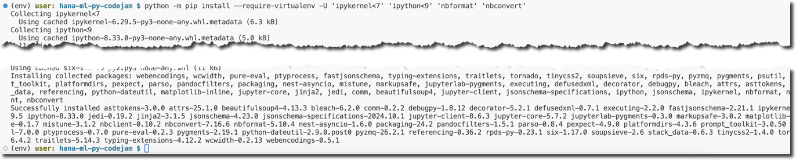

# Setup SAP Business Application Studio and a dev space

## [1/10] Use SAP Business Technology Platform
It is assumed that you have access to the SAP Business Technology Platform - either via your organization or via a free trial, as described in [prerequisites](../../prerequisites.md).

If you are using SAP BTP Trial, then open it: https://hanatrial.ondemand.com/

## [2/10] Open SAP Business Application Studio
If you are using the [SAP BTP free trial](https://account.hanatrial.ondemand.com/trial/#/home/trial), then open [SAP Business Application Studio trial](https://triallink.us10.trial.applicationstudio.cloud.sap/) from the "Quick Tool Access" section.


Should you have issues opening SAP Business Application Studio (for example when you have had the account for a long time), then check the steps in [this tutorial - Set Up SAP Business Application Studio for Development](https://developers.sap.com/tutorials/appstudio-onboarding.html)

## [3/10] Create a new Dev Space for CodeJam exercises

Go to your instance of SAP Business Application Studio (further referred to as "BAS").

For this SAP CodeJam exercise create a new Dev Space called `CodeJamHANAML` of a kind **Basic** with an additional extension **Python Tools** in BAS:

|Screen element|Value|
|-|-|
|Dev Space name|`CodeJamHANAML`|
|Kind|**Basic**|
|Additional extension|**Python Tools**|


You should see the dev space **STARTING**.


Wait for the dev space to get into the **RUNNING** state and then open that dev space.


## [4/10] Clone the exercises from the Git repository

Once your dev space is open in the BAS, use one of the available options to clone this Git repository with exercises using the URL 👇🏼 
```sh
https://github.com/SAP-samples/hana-ml-py-codejam.git
```
☝🏻 into your `project` directory in the BAS Dev Space.


Click **Open** to open a project in the Explorer view.


## [5/10] Open the Workspace

The cloned repository contains a file `codejam.code-workspace` and therefore you will be asked, if you want to open it. Click **Open Workspace**.


If you missed the previous dialog, then you can go to the BAS Explorer, click on the `codejam.code-workspace` file, and then click on the **Open Workspace**.


You should see:
* **CODEJAM** as the workspace at the root, and
* **`hana-ml-py-codejam`** as the name of the top level project folder.
* 👉🏼 The top level project folder **should not say `hana-ml-py-codejam-1`** or have any other number ending! This would mean you cloned the repository too many times, and you are in the wrong folder! Ask your SAP CodeJam instructor how to fix it.


## [6/10] Check that the required extensions are installed

> SAP provides you with a mechanism to access third-party sites to view and download open-source, 3rd party or its own tools, libraries, or software components ("Extensions") to dev spaces in SAP Business Application Studio. Using this mechanism, you can view and install VS Code Extensions from the [VSX Open Registry](https://open-vsx.org/) at your own risk.

Go to **Extensions** using the activity bar (the left-most bar in the IDE). If you see the disclaimer, but cannot close it, then extend it width until you see the **OK** button. Click **OK** butter after reading the disclaimer.


Make sure you are in **Extensions** and type `@builtin Py` in the search bar. 

You should see **Python** and **Jupyter** extensions installed already.


## [7/10] Create a virtual environment with `venv` from a command line

The built-in [venv module](https://docs.python.org/3.9/library/venv.html#module-venv) in Python provides support for creating lightweight “virtual environments”. Each virtual environment has its own Python binary (which matches the version of the binary that was used to create this environment) and can have its own independent set of installed Python packages in its site directories.

Open a built-in terminal in BAS, eg. using the menu option.


Make sure you are in the `/home/user/projects/hana-ml-py-codejam` directory, e.g., using the `pwd` command.

Use `venv` to create a virtual environment for your project in the new directory `~/projects/hana-ml-py-codejam/env` by using the following command:

```shell
python3 -m venv ~/projects/hana-ml-py-codejam/env --upgrade-deps
```

Check that the virtual environment was successfully created:

```shell
ls -l ~/projects/hana-ml-py-codejam/env
```


## [8/10] Activate the virtual environment `env` from a command line

Activate the virtual environment using the following command:

```shell
source ~/projects/hana-ml-py-codejam/env/bin/activate
```

You should see you are in a virtual environment as indicated by the `(env)` prefix in a shell's prompt.


## [9/10] Install required Python packages in the virtual environment

Install:

1. the `ipykernel` package to be able to run Python code in a Jupyter extension, and Jupyter's own [utilities for programmatic work with notebook documents](https://docs.jupyter.org/en/latest/projects/conversion.html): `nbformat` to be able to run one notebook from another, and `nbconvert` to be able to clean the output of notebooks, eg. before pushing to the Git repository, using the following command:

```shell
python -m pip install --require-virtualenv -U 'ipykernel<7' 'ipython<9' 'nbformat' 'nbconvert'
```



2. the [Python machine learning client for SAP HANA](https://pypi.org/project/hana-ml/) (`hana-ml`) and other required dependencies listed in https://help.sap.com/doc/cd94b08fe2e041c2ba778374572ddba9/2024_1_QRC/en-US/Installation.html#installation-guide using the following command:

```shell
python -m pip install --require-virtualenv -U 'hana-ml<2.24' 'ipywidgets' 'graphviz'
```


Now, check all required packages are installed:

```shell
python -m pip list --not-required
```


## [10/10] Open the "Check Setup" notebook from the exercises

In your BAS hide the terminal.


Go to Explorer in the SAP Business Application Studio, and open a `exercises/010-check_setup.ipynb` notebook. 

The notebook should open.

Next, **if** the [kernel](https://code.visualstudio.com/docs/datascience/jupyter-kernel-management) `env` is not automatically selected, open the kernel picker by clicking on **Select Kernel** on the upper right-hand corner of your notebook and select a kernel `env` (the virtual environment you set up earlier) from **Python Environments**.


Should you get messages about Jupyter server processes started in the background, click on the Settings icon and turn off informations and warnings from this extension.


## 🤓 Now you are ready to use SAP Business Application Studio for the exercises. Wait for the rest of the group to get to that same point. The SAP CodeJam instructor will share the required database user and password details to everyone at the same time!