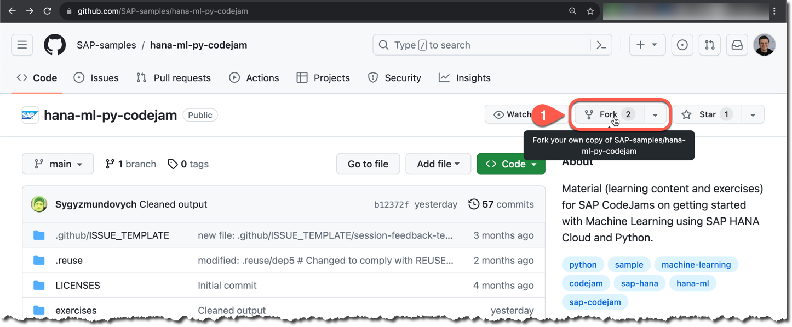
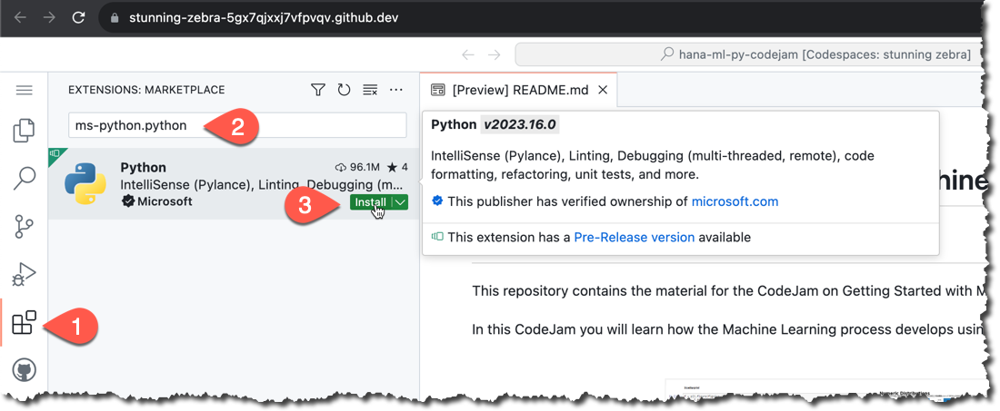
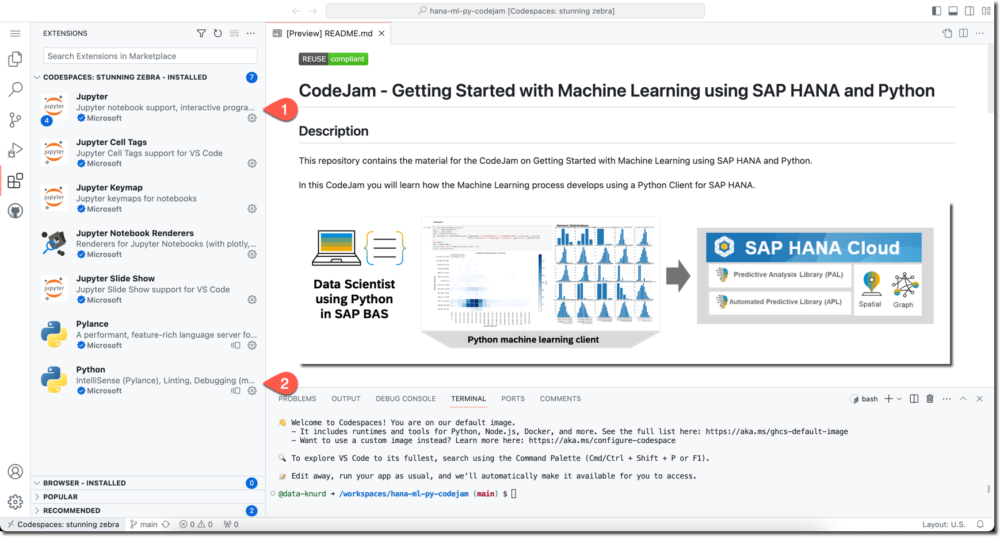
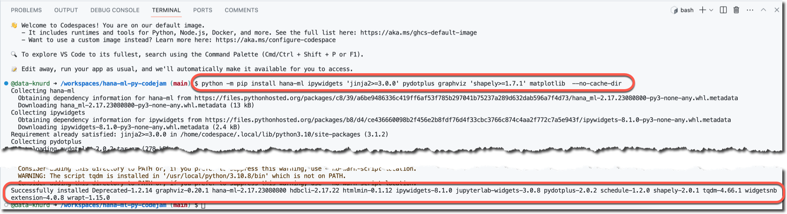
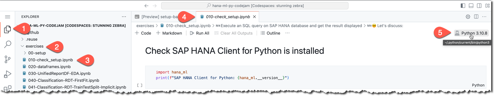

# Setup GitHub CodeSpace

## Use GitHub
It is assumed that you have account on the GitHub and have enough limits left for Codespaces within your subscription plan: https://github.com/settings/billing#usage

## Fork the exercises into your own GitHub repository

Once you are logged on to your account at https://github.com/, go to the page https://github.com/SAP-samples/hana-ml-py-codejam and click on **Fork**.



If not needed, then leave everything on the **Create a new fork** page as it was, and click **Create fork**.


## Create a codespace for your repository

Make sure you are on GitHub page with your own repository now (1).

Then (2) click on **Code**, (3) open the tab **Codespaces**, and (4) click **Create codespace**.


## Install required extensions from the marketplace: Python, Jupyter

Go to (1) **Extensions** and (2) search for `ms-python.python` extension.

Install (3) it.



Repeat the same for the extension `ms-toolsai.jupyter`.

Clean the search bar, and check that **Python** and **Jupyter** extensions are installed in your codespace.



## Install required Python packages

Install the [Python machine learning client for SAP HANA](https://pypi.org/project/hana-ml/) (`hana-ml`) and other required dependencies listed in https://help.sap.com/doc/cd94b08fe2e041c2ba778374572ddba9/2023_2_QRC/en-US/Installation.html#installation-guide using the following command:

```shell
python -m pip install 'hana_ml==2.18.*' ipywidgets 'jinja2>=3.0.0' pydotplus graphviz 'shapely>=1.7.1' matplotlib  --no-cache-dir
```



## Open the "Check Setup" notebook from exercises

In your codespace you can close your terminal now.

Go to (1) Explorer and open (2+3) the [`exercises/010-check_setup.ipynb`](../010-check_setup.ipynb) notebook. 

It should (4) open in a Jupyter extension.

The (5) kernel should be set automatically to something like `~/.python/current/bin/python3`, if you have only one installed.



## 🤓 Now you are ready to use GitHub codespace to go one-by-one through exercises! 

### Engage, learn and enjoy!