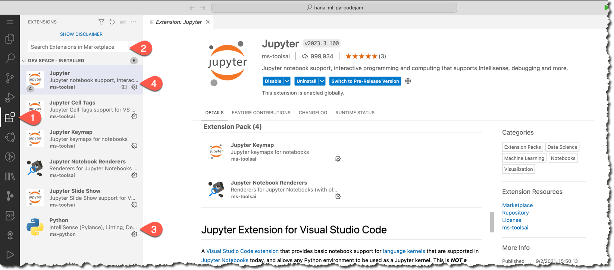
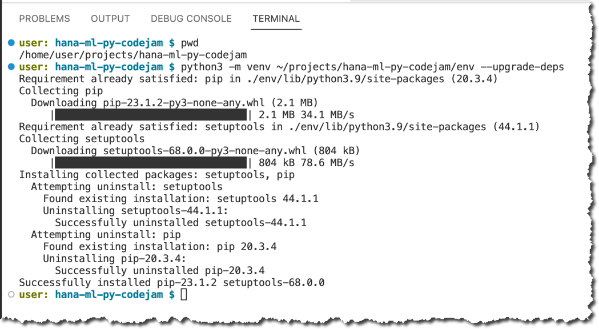
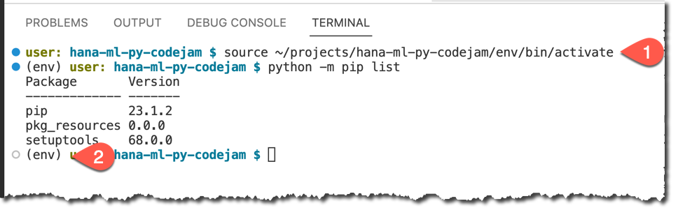
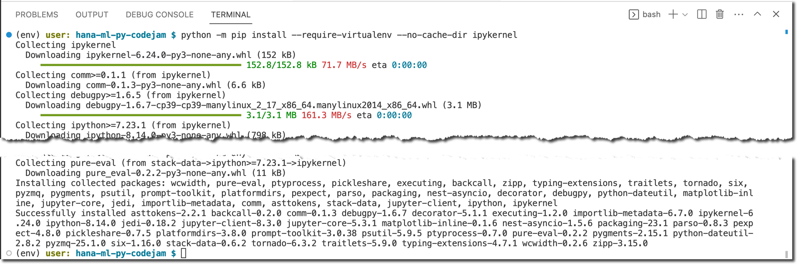
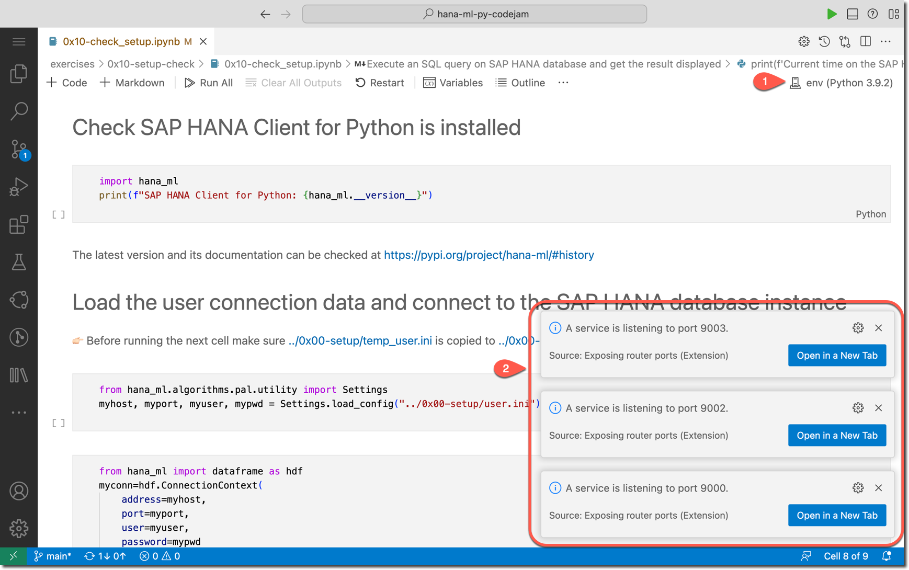

# Setup SAP Business Application Studio and a dev space

## Use SAP Business Technology Platform
It is assumed that you have access to SAP Business Technology Platform - either via your organization or via a free trial.

## Set up SAP Business Application Studio
If you are using the [SAP BTP free trial](https://developers.sap.com/tutorials/hcp-create-trial-account.html), then perform all the steps in [this tutorial - Set Up SAP Business Application Studio for Development](https://developers.sap.com/tutorials/appstudio-onboarding.html)

## Create a new Dev Space for CodeJam exercises

For SAP CodeJam exercises create a new Dev Space called `CodeJamHANAML` of a kind `Basic`.


## Clone the exercises from Git repository

Use one of the available options to clone a Git repository with exercises `https://github.com/SAP-samples/hana-ml-py-codejam.git` into your project's directory in BAS Dev Space.


Click **Open** to open a project in the Explorer view.


## Install VS Code extensions from VSX Open Registry

> SAP provides you with a mechanism to access third party sites to view and download open-source, 3rd party or its own tools, libraries, or software components ("Extensions") to dev spaces in SAP Business Application Studio. Using this mechanism, you can view and install VS Code Extensions from the [VSX Open Registry](https://open-vsx.org/) at your own risk.

> SAP does not certify or endorse any of the third-party sites or Extensions, and they are not part of SAP Business Application Studio.

Find and install two extensions:
1. Python (technical name: `ms-python`): https://open-vsx.org/extension/ms-python/python
1. Jupyter (technical name: `ms-toolsai`): https://open-vsx.org/extension/ms-toolsai/jupyter



## Create a virtual environment with `venv` from a command line

The built-in [venv module](https://docs.python.org/3.9/library/venv.html#module-venv) in Python provides support for creating lightweight “virtual environments” with their own site directories, optionally isolated from system site directories.

Open a built-in terminal, eg. using menu option.


Make sure you are in `/home/user/projects/hana-ml-py-codejam` directory, eg. using `pwd` command.

Use `venv` to create a virtual environment for your project in the new directory `~/projects/hana-ml-py-codejam/env`.

```shell
python3 -m venv ~/projects/hana-ml-py-codejam/env --upgrade-deps
```



## Install required Python packages in the virtual environment

Activate the virtual environment. 

```shell
source ~/projects/hana-ml-py-codejam/env/bin/activate
```

You should see you are in a virtual environment as indicated by `(env)` prefix in shell's prompt.



Install `ipykernel` package to be able to run Python code using Jupyter in SAP Business Application Studio.

```shell
python -m pip install --require-virtualenv --no-cache-dir ipykernel
```



Install the [Python machine learning client for SAP HANA](https://pypi.org/project/hana-ml/) (`hana-ml`) and other required dependencies listed in https://help.sap.com/doc/cd94b08fe2e041c2ba778374572ddba9/2023_1_QRC/en-US/Installation.html#installation-guide

```shell
python -m pip install hana-ml ipywidgets 'jinja2>=3.0.0' pydotplus graphviz 'shapely>=1.7.1' matplotlib  --require-virtualenv --no-cache-dir
```


## (Optional) Install optional Python packages in the virtual environment

Install Jupyter's `nbconvert` to be able to clean the output of notebooks, eg. before pushing to the Git repository
```sh
python -m pip install --require-virtualenv --no-cache-dir nbconvert
```

## Open "Check Setup" notebook

In your BAS close the terminal, and in the Explorer open a `exercises/0x10-setup-check/0x10-check_setup.ipynb` notebook. 

It should open in the Jupyter extension.

Next select a kernel `env` (the virtual environment you setup earlier) from "Python Environments".


The kernel should be set in a few second you should get messages about Jupyter server processes started in the background ready to execute code from your notebook.



## 🤓 Now you are ready to go through exercises! Engage, learn and enjoy!